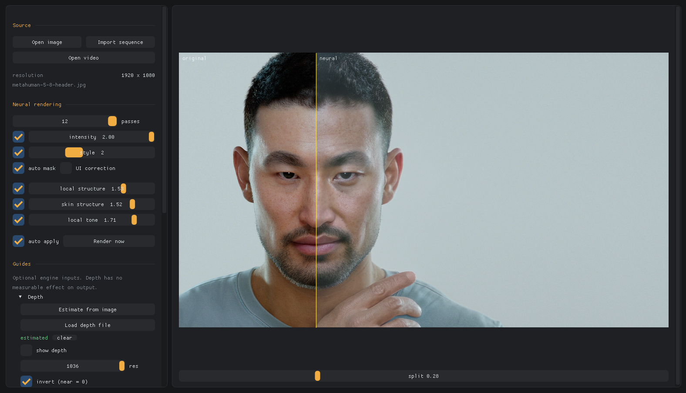
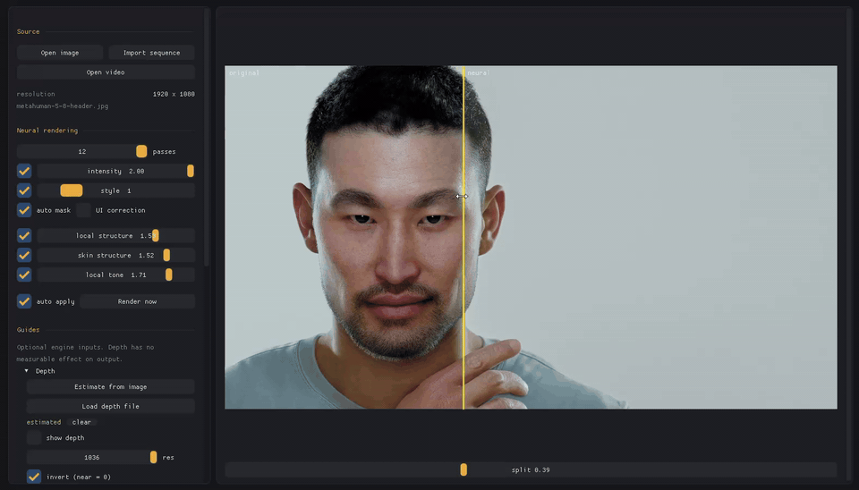
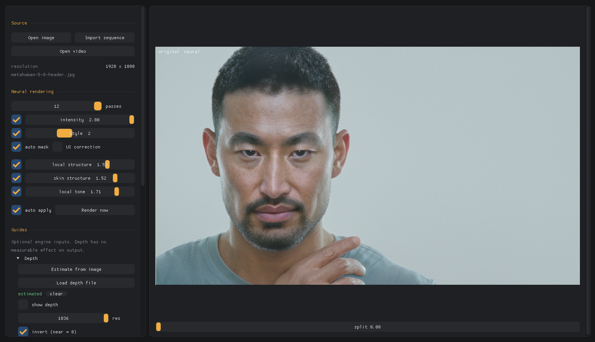

# dlssnr-studio

Runs NVIDIA's DLSS 5 Neural Rendering runtime over still images, rendered
image sequences and video, outside a game. A command-line tool plus an
interactive GUI, on Direct3D 12.

Works on **RTX 20/30/40/50** given a matching runtime build — including cards
NVIDIA excluded from the feature.



A few seconds of it in use:





---

## Get it

1. Download `dlssnr-studio-win-x64.zip` from the
   [latest release](https://github.com/kks3800/dlssnr-studio/releases) and
   extract it.
2. Run `get-runtime.ps1` in the extracted folder (right-click → *Run with
   PowerShell*). It fetches ONNX Runtime, DirectML and the two optional ONNX
   models from Microsoft, Hugging Face and GitHub. The zip itself ships no
   DLLs.
3. Copy your `nvngx_dlssnr.dll` into the same folder. See below.

`START-HERE.txt` in the zip walks through the same three steps.

---

## You must supply nvngx_dlssnr.dll yourself

It is not in this repo, not in the release zip, and will not be. It is
unreleased proprietary NVIDIA code, 158 MB (over GitHub's per-file limit
anyway), and not ours to redistribute.

### Where to put it

**Next to the .exe files** — the same folder, not a subfolder:

```
dlssnr-studio\                        <- release zip, extracted
    dlssnr-studio.exe
    dlssnr-image.exe
    nvngx_dlssnr.dll                  <- put it here
    onnxruntime.dll                   <- get-runtime.ps1 fetches these
    DirectML.dll                      <-
    depth-anything-v2-small.onnx      <-  (optional)
    raft.onnx                         <-  (optional)
    get-runtime.ps1
    START-HERE.txt
    ...
```

Building from source, that folder is `build\Release\`.

The CLI can be pointed elsewhere with `--snippet <path>`:

```
dlssnr-image.exe in.png -o out.png --snippet D:\somewhere\nvngx_dlssnr.dll
```

**The GUI has no such override** — `dlssnr-studio.exe` only ever looks beside
itself, so for the GUI the DLL must be in that folder.

You do not need `nvngx.dll`. The tool finds the NGX core automatically in the
driver store; only the feature runtime above is missing.

If it is absent or unreadable you get an immediate startup error naming the
path it tried, rather than a silent failure.

**It must contain compiled kernels for your GPU's architecture.** Check before
you waste time:

```
python tools/fatbin_walk.py path\to\nvngx_dlssnr.dll
```

It prints every architecture embedded in the DLL:

| arch | GPUs |
|---|---|
| `sm_75` | RTX 20 (Turing) |
| `sm_86` | RTX 30 (Ampere) |
| `sm_89` | RTX 40 (Ada) |
| `sm_120` | RTX 50 (Blackwell) |

If your architecture is not listed, that DLL cannot run on your card, whatever
its description claims.

---

## Build

Requires Visual Studio 2022, CMake 3.20+, Windows SDK 10.

```
pwsh -File scripts/fetch-deps.ps1
cmake -S . -B build -G "Visual Studio 17 2022" -A x64
cmake --build build --config Release
```

Then copy `nvngx_dlssnr.dll` into `build/Release/`.

The fetch script pulls Dear ImGui, the public NGX headers, tinyexr, ONNX
Runtime and two ONNX models (~500 MB total) into `external/`. None of it is
committed. The build stages `onnxruntime.dll`, `DirectML.dll` and the models
beside the executables.

`scripts/package.ps1` does the configure and build and then assembles the
release zip in `dist/` — executables, docs, licence, `get-runtime.ps1` and
`tools/fatbin_walk.py`, and nothing binary beyond the two executables. It
refuses to zip if a DLL or model has crept into the staging folder.

ONNX Runtime is the **DirectML** build, not the CPU one, and it is not
optional for anything that renders video: RAFT optical flow costs ~900 ms a
frame on the CPU provider against ~65 ms on the GPU, which was 96% of a render
before the switch. It falls back to CPU on a machine with no usable DX12
device, so it still runs -- just slowly. DirectML rather than CUDA because
this is already a D3D12 program: nothing extra to ship, and it works on any
DX12 GPU rather than only NVIDIA ones.

### Building with Visual Studio 2017

VS2017's MSVC 19.16 rejects the ONNX Runtime 1.20.1 C++ header as-is:
`onnxruntime_cxx_api.h` declares `constexpr` constructors and `FromBits`
helpers whose bodies call a non-`constexpr` base-class constructor
(`C3615: constexpr function ... cannot result in a constant expression`).
Newer MSVC (2022) accepts it; 19.16 does not.

Fix: drop the `constexpr` qualifier from the four affected declarations in
`external/onnxruntime/onnxruntime-win-x64-dml-1.20.1/include/onnxruntime_cxx_api.h`
(affecting `Float16_t` and `BFloat16_t`):

```diff
-  constexpr explicit Float16_t(uint16_t v) noexcept { val = v; }
+  explicit Float16_t(uint16_t v) noexcept { val = v; }
-  constexpr static Float16_t FromBits(uint16_t v) noexcept { return Float16_t(v); }
+  static Float16_t FromBits(uint16_t v) noexcept { return Float16_t(v); }
-  constexpr explicit BFloat16_t(uint16_t v) noexcept { val = v; }
+  explicit BFloat16_t(uint16_t v) noexcept { val = v; }
-  static constexpr BFloat16_t FromBits(uint16_t v) noexcept { return BFloat16_t(v); }
+  static BFloat16_t FromBits(uint16_t v) noexcept { return BFloat16_t(v); }
```

These types are never used in a constant expression by this project, so losing
`constexpr` changes nothing at runtime. `external/` is not committed, so the
patch is re-applied after each `fetch-deps.ps1` run. Then configure with the
VS2017 generator:

```
cmake -S . -B build -G "Visual Studio 15 2017" -A x64
cmake --build build --config Release
```

Then copy `nvngx_dlssnr.dll` into `build/Release/`.

---

## Usage

### GUI

```
build\Release\dlssnr-studio.exe
```

**Drop a file, a folder or a video on the window** — an image loads as a
still, a folder imports as a sequence with its passes, a video opens for
scrubbing. Or use **Open image** / **Import sequence**, which takes any single
frame and finds the rest.

Drag the yellow seam across the image to compare, scroll to zoom, drag to pan.
Sliders re-render automatically after a 250 ms pause, and superseded requests
are dropped so dragging one does not queue up ten evaluations.

| Key | |
|---|---|
| **Space** (hold) | peek at the original |
| **F** | fit to window |

The panel leads with the controls that measurably do something. Only `preset`
and `perf/quality` are demoted to a collapsed section.

For video, scrub to a shot, tune on it, then render the clip or a from/to
range of it. Frames stream decoder → NR → encoder without touching the disk,
and the canvas shows the frame number and timestamp while a render runs. A GPU
picker is in the panel for machines with more than one adapter.

### CLI

```
dlssnr-image <input.png> -o out.png [options]
```

Sequences, with temporal history carried across frames:

```
dlssnr-image --sequence <dir|any frame> --out-dir out --video out.mp4 --fps 24
```

Video, streamed straight through (needs `ffmpeg` and `ffprobe` on PATH):

```
dlssnr-image --video-in clip.mp4 -o out.mp4 --estimate-motion --from 240 --frames 500
```

`dlssnr-image --help` lists every option; `--list-gpus` numbers the adapters
for `--gpu <n>`.

### Engine renders: point it at the folder

Depth and velocity passes are found automatically. Both of Unreal Movie Render
Queue's layouts are recognised, plus one level of subfolders:

```
subfolder layout                 filename layout
---------------------------      ---------------------------
MyShot/                          MyShot/
    Shot.0000.png                    Shot.0000.png
    SceneDepth/                      Shot.SceneDepth.0000.exr
        Shot.0000.exr                Shot.Velocity.0000.exr
    Velocity/
        Shot.0000.exr
```

Matched on `velocity`/`motionvector`/`mvec` and `scenedepth`/`depth`/`zdepth`.
The largest unclassified sequence becomes the beauty pass, so a plain folder of
colour frames still works with no naming convention at all. `nr_out` and
`nr_mv` are skipped so a second run does not ingest the first one's output.

**EXR is supported and matters here.** Velocity is signed and depth needs float
range; neither survives an 8- or 16-bit PNG. Channels are mapped by name, so a
single-channel depth pass (`R`, `Y` or `Z`) and a two-channel velocity pass both
load correctly.

If your velocity pass is in normalised screen space rather than pixels, add
`--mvec-ndc`. NR wants pixels -- see below.

Useful options:

| Flag | Meaning |
|---|---|
| `--snippet <path>` | where `nvngx_dlssnr.dll` is; defaults to beside the exe |
| `--gpu <n>` | adapter index from `--list-gpus`; default is DXGI's high-performance pick |
| `--style <n>` | see below; default 2 |
| `--intensity <f>` | 0 = identity, 1 = full. Linear blend, clamps at 1 |
| `--local-tone <f>` | 0..2; the most useful strength control |
| `--local-structure <f>` | 0..2; peaks near 1.5 |
| `--auto-mask <0\|1>` | the runtime's own mask |
| `--ui-correction <0\|1>` | `DLSSNR.UICorrection` |
| `--mask <file>` | `DLSSNR.ControlMask`; white applies, black suppresses |
| `--iterations <n>` | temporal passes per image; default 8 |
| `--estimate-depth` | monocular depth via Depth Anything V2 (`--depth-out` saves it) |
| `--estimate-motion` | optical flow via RAFT, for footage with no velocity pass |
| `--mvec <dir>` | engine-exported velocity pass instead of the detected one |
| `--depth-seq <dir>` | depth pass sequence instead of the detected one |
| `--mvec-ndc` | velocity is normalised screen space, not pixels |
| `--mvec-invert` | flip sign if it stores previous->current |
| `--no-auto-passes` | do not auto-detect depth/velocity |
| `--video-in <clip>` | stream a video; `--from <n>` and `--frames <n>` pick a range |
| `--mv-out <file>` | save the first frame's optical flow as a PNG, for checking it |
| `--sweep <param> --sweep-values a,b,c` | contact sheet of 1:1 crops; `--crop x,y,w,h` picks the crop |
| `--badge <file>` | write the AI disclosure badge PNG on its own |
| `--backbuffer <0\|1\|2>` | experimental: bind `DLSSNR.Backbuffer` (1 = previous output, 2 = the input) |
| `--distortion <0\|1\|2>` | experimental: bind `DLSSNR.BidirectionalDistortionField` (1 = zero, 2 = test swirl) |

The two experimental flags bind keys the snippet reads but that nothing fed
before. They exist to find out whether the network reacts to them; the default
of 0 leaves both unbound, which is the behaviour every measurement here was
made with.

---

## What actually does something

Every value below is a measured `diff vs input` on the same 1080p still, two
passes, 256px crop. Ranges match the addon's own sliders: **0 to 2 for
everything except skin structure, which is -1 to 2. Default is 1.**

| Parameter | 0 | 1 | 2 | Behaviour |
|---|---|---|---|---|
| `local-tone` | 0.0063 | 0.0132 | **0.0162** | Responds across the whole range. The most useful strength control. |
| `local-structure` | 0.0085 | 0.0132 | 0.0139 | Works, peaking near 1.5 (0.0142) then easing off. |
| `intensity` | 0.0000 | 0.0132 | 0.0132 | Linear 0 to 1, then **clamps** — above 1 does nothing. 0 is a verified exact identity. |
| `skin` | 0.0100 | 0.0132 | 0.0132 | Effectively on/off: only 0 differs. -1, -0.5, 1 and 2 are all identical. |
| `style` | 0.0147 | 0.0124 | 0.0132 | Three distinct looks. 0 warms and darkens, 1 is over-cooked, 2..6 are identical and cleanest. |
| `preset` | 0.0132 | 0.0132 | 0.0132 | Genuinely inert across 0..3, the same range the addon offers. |

`auto-mask` and `ControlMask` also work; black is a verified exact identity.
`depth` has no measurable effect. `perf/quality` is inert.

`global-tone` is not a runtime key at all — it exists only in the addon's own
shader, alongside Scene Paper-White Scale, HDR Transfer Strength and Colour
Strength. None of those four are NR parameters.

Recommended starting point: `--style 2 --auto-mask 1 --local-tone 1.5`.

**A note on how this table was built.** An earlier version of it was wrong
twice. The first map declared `local-structure`, `local-tone`, `preset` and
`perf` inert after sweeping only `skin` and `global-tone` and generalising —
four parameters written off on zero measurements. The second blamed missing
depth/motion guides, which was also wrong: these work on a bare still. Every row
above is now an actual sweep of that specific parameter.

Two traps worth recording. `-1` used to be the "leave unset" sentinel, which
collides with skin structure's legitimate `-1`, so that value was silently
unreachable; the sentinel is now `-1000`. And the sliders were capped at 1,
hiding the upper half of every range — `local-tone` at 2 gives a quarter more
effect than at 1.

### Motion vectors

Consumed, in **pixels** (not NDC — NDC-scaled vectors produce literally zero
effect). The runtime clamps beyond roughly 10x correct magnitude. With
correctly scaled vectors the difference is real but small: 35.8 dB PSNR against
the no-motion result on test footage.

---

## Performance

Measured on an RTX 3070 Ti, 4K sequence, per frame:

```
wall    3655 ms
  gpu   3359 ms   91.9%
  other  269 ms    7.3%
  load    26 ms    0.7%
  save     1 ms    0.0%
```

Roughly 950 ms per evaluation at 1080p, so **work at 1080p while exploring
parameters** and go to 4K only for finals -- that is by far the largest
practical speedup available.

Image decode runs a frame ahead and encode runs on worker threads, so both hide
behind the GPU rather than adding to it. D3D12 textures and staging buffers are
reused between calls; recreating them per frame was costing ~1.2 s a frame in
driver stalls alone.

Video streams through pipes rather than staging frames on disk, which took
~660 ms a frame and 3 MB of disk each at 4K off the cost. With optical flow on
the GPU a 4K video render runs at ~540 ms a frame on the same card, of which
flow is ~95 ms.

**The rest is the network and cannot be improved from here.** The sm_86 build
runs FP16 MMA because Ampere has no FP8 or FP4 tensor cores, which is precisely
what this network was designed around. Blackwell executes the same 140 MB of
weights in far cheaper precision. That gap is silicon, not software.

---

## More

* [`pipeline/README.md`](pipeline/README.md) — a batch pipeline that runs a
  video through the tool: extract, enhance, mark, encode, optionally upload.
* `tools/fatbin_walk.py` lists which GPU architectures a runtime DLL was built
  for; `tools/make_test_exr.py` writes minimal EXR test passes.

---

## Licence

BSD 2-Clause — see [`LICENSE`](LICENSE).

The NVIDIA runtime this loads is not covered by that licence and is not
distributed with it. The third-party components the build fetches are not
vendored and keep their own licences: [Dear ImGui](https://github.com/ocornut/imgui)
(MIT), [tinyexr](https://github.com/syoyo/tinyexr) and miniz (BSD-3-Clause /
MIT), [ONNX Runtime](https://github.com/microsoft/onnxruntime) (MIT),
[DirectML](https://www.nuget.org/packages/Microsoft.AI.DirectML) (Microsoft's
own licence), the [NGX SDK headers](https://github.com/NVIDIA/DLSS) (NVIDIA's
SDK licence), and the
[Depth Anything V2 Small](https://huggingface.co/onnx-community/depth-anything-v2-small)
and [RAFT](https://github.com/opencv/opencv_zoo/tree/main/models/optical_flow_estimation_raft)
models under the licences on their pages.
